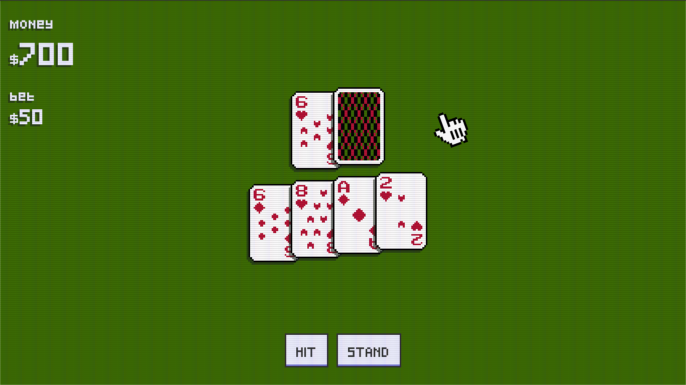

# React Blackjack

This is a simple project created with the intention of practicing some technologies that I have learned lately, in the absence of better ideas, I decided to create a game. And therefore, the technological stack chosen for the project may not make any sense.
There are still a number of things to implement that will be added gradually.
  
Demo here: [https://react-blackjack-32169.firebaseapp.com/](react-blackjack)
  
Use `npm start` to run the game in [http://localhost:3000](http://localhost:3000)
  
### Screenshots

